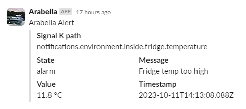

# signalk-slack-notify

## Create Slack account and private free Workspace
https://app.slack.com/get-started#/createnew
- Make you own Slack workspace
- Add #alert channel
  
## Make a Bot
https://api.slack.com/apps
- Create A New App (From scratch)
- Name Your bot & pick your workplace

### Basic Information
- Configure "Display Information"
- Add "Incoming Webhooks"

#### Incoming Webhooks
- Activate Incoming Webhooks
- Add "Add New Webhook to Workspace"

##### Test post
- Select channel, e.g. #alerts -> Allow
- Copy Webhook URL (will be used in SIgnal K plugin)

## Signal K Plugin Config
### Signal K notifications to Slack
- Paste Slack Webhook URL to plugin config
- Add message title
- Add Slack channel, default #alert

