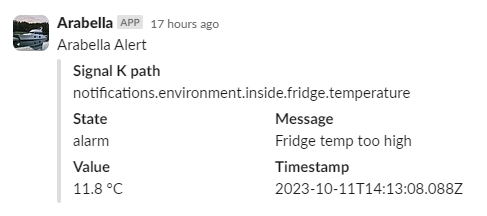

# signalk-slack-notify

Send Signal K notifications to Slack through an incoming webhook.

## Create Slack account and private free Workspace

https://app.slack.com/get-started#/createnew

- Make you own Slack workspace
- Add #alert channel
- Select alert levels

## Make a Bot

https://api.slack.com/apps

- Create A New App (From scratch)
- Name Your bot & pick your workplace

### Basic Information

- Configure "Display Information"
- Add "Incoming Webhooks"

#### Incoming Webhooks

- Activate Incoming Webhooks
- Add "Add New Webhook to Workspace"

##### Test post

- Select channel, e.g. #alerts -> Allow
- Copy Webhook URL (will be used in SIgnal K plugin)

## Signal K Plugin Config

### Signal K notifications to Slack

- Paste Slack Webhook URL to plugin config
- Add message title
- Add Slack channel, default #alert
- Select alert levels to send

## Behaviour

### State change deduplication

Slack notifications are only sent when a notification's state actually changes. If Signal K repeatedly delivers the same state for a path (e.g. `alarm → alarm → alarm`), only the first occurrence triggers a Slack message. A new message is sent as soon as the state transitions to a different value (e.g. `alarm → warn` or `alarm → normal`).

State history is reset when the plugin stops or restarts, so the first notification after a restart always fires.

## Development

- `npm install`
- `npm run format` checks formatting
- `npm run lint` runs ESLint
- `npm run typecheck` runs strict TypeScript checks
- `npm test` runs the Node test suite
- `npm run build` compiles the plugin to `dist/`
- `npm run audit` fails on high or critical vulnerabilities
- `npm run verify` runs the full release-readiness gate: format, lint, typecheck, tests, build, audit, and `npm pack --dry-run`
